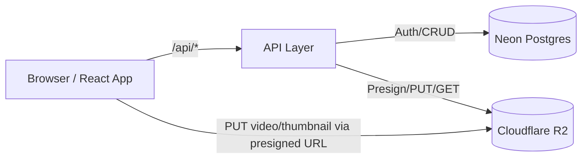

# Bluefilm Website Architecture

This document describes the architecture of the Bluefilm website across frontend, backend, database, storage, deployment, and local development workflows.

## Overview

- **Frontend**: React (CRACO) SPA served as static assets.
- **API layer**: Serverless functions with two implementations:
  - Cloudflare Pages Functions (Hono) for production.
  - Netlify Functions (Node) for compatibility and local usage.
- **Database**: Neon Postgres (serverless Postgres) for users and videos metadata.
- **Storage**: Cloudflare R2 for video files and thumbnails, using direct browser uploads via presigned URLs.
- **Deployment**: Cloudflare Pages with Functions and R2 binding. Production domain: bluefilmx.com.

---

## Frontend

- **Location**: `new-website-paid/frontend/`
- **Stack**:
  - React 19, React DOM (`package.json: dependencies`).
  - CRA toolchain via CRACO (`craco.config.js`).
  - Axios for HTTP.
  - React Router (minimal custom router in `AppRouter`).
- **Key file**: `src/App.js`
  - `AuthProvider` provides token-based auth context.
  - `MainApp` renders homepage, search, category filters, and video grid.
  - `VideoPage` renders a dedicated video view with "Up Next".
  - `VideoPlayer` builds a streaming URL `/api/videos/:id/stream` (optionally with token).
  - `AdminPanel` exposes moderation actions and an upload entrypoint.
  - `UploadForm` performs direct-to-R2 uploads:
    1) `POST /api/uploads/presign` to obtain a presigned PUT URL and `storageKey`.
    2) Browser `PUT` to R2 with XHR for progress.
    3) `POST /api/videos` to create DB record (includes optional `thumbnailKey`).
- **API Base**: `API` in `src/App.js` uses `REACT_APP_BACKEND_URL` if present, otherwise relative `/api`.
- **Dev Proxy**: `src/setupProxy.js` maps `/api/*` to `http://localhost:9999/.netlify/functions/api/*` for Netlify local functions.

## API Layer

Two function runtimes are available. Production uses the Cloudflare variant.

### Cloudflare Pages Functions (Production)
- **Location**: `new-website-paid/frontend/functions/[[path]].ts`
- **Framework**: Hono
- **Bindings / Env**: configured via `wrangler.toml` and Pages env
  - `VIDEOS` R2 bucket binding (see Storage).
  - `DATABASE_URL` (Neon), `JWT_SECRET`, `R2_*` credentials, optional `STREAM_PRESIGN`.
- **Endpoints (subset)**:
  - `GET /api/health`
  - `POST /api/auth/register`, `POST /api/auth/login`, `GET /api/auth/profile`
  - `POST /api/uploads/presign` → returns presigned `uploadUrl` and `storageKey`
  - `POST /api/videos/upload` (<= ~10MB fallback via R2 binding)
  - `POST /api/videos` (create DB record after direct-to-R2)
  - `GET /api/videos` (with optional `status`/`category`, admin-aware)
  - `GET /api/videos/:id` (metadata)
  - `ALL /api/videos/:id/stream` (binding stream by default; optional presigned GET when `STREAM_PRESIGN=true`)
  - Admin: `POST /api/videos/:id/approve`, `POST /api/videos/:id/reject`, `DELETE /api/videos/:id`
  - Thumbnails: `GET /api/videos/:id/thumbnail`, `PUT /api/videos/:id/thumbnail`
- **DB Access**: Neon serverless via `@neondatabase/serverless` with SQL strings.
- **R2 Access**: Directly through R2 binding `VIDEOS` for PUT/GET/DELETE and custom presign using Workers Web Crypto.

### Netlify Functions (Compatibility / Local)
- **Location**: `new-website-paid/frontend/netlify/functions/api.ts`
- **Endpoints**: Parity with Cloudflare functions for auth/videos/uploads.
- **DB Access**: Node `pg` client using `DATABASE_URL` (Neon).
- **Storage**:
  - Prefers Cloudflare R2 via AWS S3 SDK when configured.
  - Can fallback to Supabase Storage if R2 not configured.
  - Has a local filesystem fallback for development.
- **CORS**: Enabled for API responses.

### Legacy FastAPI Server (Experimental)
- **Location**: `new-website-paid/backend/server.py`
- **Stack**: FastAPI, MongoDB, local disk streaming.
- Currently retained for experiments; not used in production.

## Database

- **Engine**: Neon Postgres (serverless Postgres), referenced via `DATABASE_URL`.
- **Schema**: created on-demand by functions (`ensureSchema`). Key tables:
  - `users(id, email, name, password_hash, age_verified, is_admin, is_approved, created_at)`
  - `videos(id, title, description, category, tags text[], status, views, uploader_id, storage_key, thumbnail_key, created_at, updated_at)`
- **Notes**:
  - Email uniqueness enforced (case-insensitive index in Cloudflare Functions code).
  - Admin and approval states drive visibility and moderation.

## Storage

- **Provider**: Cloudflare R2
- **Bucket**: `bluevideos`
  - Configured in `wrangler.toml` as binding `VIDEOS` to Pages Functions.
  - Exposed to code via env vars `R2_ENDPOINT`, `R2_ACCESS_KEY_ID`, `R2_SECRET_ACCESS_KEY`, `R2_BUCKET`.
- **Upload Flow**:
  - Presigned PUT URLs returned by `/api/uploads/presign` (Cloudflare Functions or Netlify Functions).
  - Browser performs direct `PUT` to R2 (bypasses server payload limits).
  - On success, the client calls `POST /api/videos` to save metadata and `storageKey`.
- **Thumbnails**: Optional custom thumbnails uploaded the same way; stored as `thumbnail_key` on videos.

## Deployment

- **Platform**: Cloudflare Pages
  - **Static build output**: `frontend/build` (see `wrangler.toml: pages_build_output_dir`).
  - **Functions**: `frontend/functions/[[path]].ts` (Hono) handle `/api/*` on the edge.
  - **R2 binding**: `VIDEOS` mapped to bucket `bluevideos` via `wrangler.toml`.
  - **Project name**: `bluefilmx` (see `package.json` script `pages:deploy`).
  - **Domain**: Production domain `bluefilmx.com` (DNS → Cloudflare Pages project).
- **Commands**:
  - Build: `npm run build` in `new-website-paid/frontend/` (via CRACO)
  - Deploy (Pages): `npm run pages:deploy` (uses `wrangler pages deploy`)

## Local Development

- **Frontend dev server**:
  - From `new-website-paid/frontend/`: `npm start` (CRACO dev server). Default shown port is 3001.
- **API during dev** (two options):
  - Option A: Netlify Functions
    - Start: `npx netlify functions:serve --port 9999` in `new-website-paid/frontend/`.
    - `src/setupProxy.js` proxies `/api/*` → `http://localhost:9999/.netlify/functions/api/*`.
  - Option B: Cloudflare Pages Functions
    - Start: `npm run pages:dev` in `new-website-paid/frontend/`.
    - Serves static site and `/api/*` with the Hono app locally via Wrangler.
- **Configuration**:
  - Frontend may use `REACT_APP_BACKEND_URL` to point at a remote API; otherwise relative `/api` is used.
  - Functions require `DATABASE_URL`, `JWT_SECRET`, and (for R2) `R2_*` env vars. On Cloudflare, bind `VIDEOS` and set env vars in the Pages project.

## Security & Constraints

- **Auth**: JWT-based, bearer tokens stored client-side; `/api/auth/profile` validates tokens.
- **Admin-only**: Uploads and moderation endpoints require admin privileges.
- **CORS**: Enabled in functions; R2 bucket must allow CORS from production domain.
- **Large uploads**: Direct-to-R2 presign approach prevents serverless gateway limits.

## Notable Files & Config

- Frontend application: `new-website-paid/frontend/src/App.js`
- Dev proxy: `new-website-paid/frontend/src/setupProxy.js`
- Cloudflare Functions (production API): `new-website-paid/frontend/functions/[[path]].ts`
- Netlify Functions (compat API): `new-website-paid/frontend/netlify/functions/api.ts`
- Cloudflare wrangler config: `new-website-paid/wrangler.toml`
- CRACO config: `new-website-paid/frontend/craco.config.js`

---

## Operational Notes

- Prefer Cloudflare Pages Functions + R2 for production.
- Ensure R2 CORS allows the production origin `https://bluefilmx.com` for direct uploads and streaming.
- Keep `STORAGE_BACKEND` and `STREAM_PRESIGN` environment toggles aligned with desired streaming method.
- The legacy FastAPI/Mongo service is not part of production and can be ignored unless doing local experimentation.
